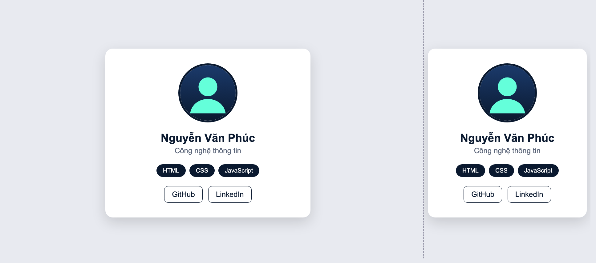
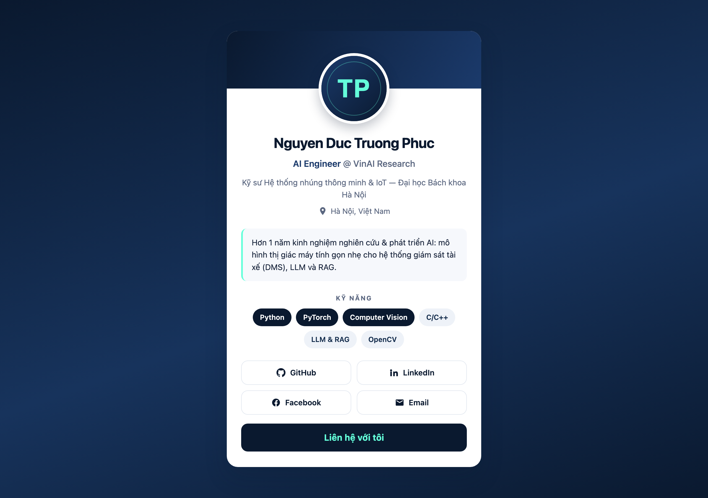
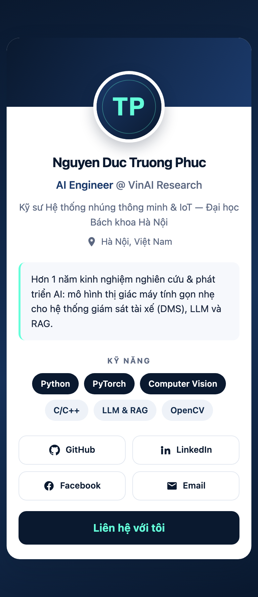

# Nhật ký Vibe Coding (AI Log)

**Bài tập:** Xây dựng trang giới thiệu cá nhân dạng card (Portfolio Card)
**Sinh viên:** Nguyen Duc Truong Phuc
**Công cụ AI:** Claude Code (model Claude Opus)
**Ngày thực hiện:** 12/09/2026
**Thời lượng:** ~40 phút, 3 vòng lặp prompt → kết quả → chỉnh sửa

---

## Tổng quan quy trình

```
Vòng 1: Prompt khởi đầu (theo gợi ý của đề)
        → HTML/CSS cơ bản → chạy thử → phát hiện 4 lỗi
Vòng 2: Đưa file CV thật (PDF) cho AI đọc
        → thay toàn bộ nội dung giả bằng dữ liệu thật + làm lại layout
Vòng 3: Kiểm thử responsive ở 360px / 1280px
        → sửa breakpoint, tinh chỉnh thủ công
```

---

## VÒNG 1 — Dựng khung ban đầu

### 1.1. Prompt ban đầu

> "Tạo một trang HTML+CSS giới thiệu cá nhân dạng card, có ảnh đại diện hình tròn, tên, chuyên ngành, danh sách 3 kỹ năng dạng badge, và 2 icon mạng xã hội. Dùng màu chủ đạo xanh navy."

### 1.2. Kết quả nhận được

AI sinh ra 3 file: `index.html`, `style.css`, `assets/avatar.svg` (ảnh đại diện
dạng SVG hình người, không phụ thuộc mạng).

**Ảnh chụp v1** (trái: khung 900px giả lập desktop — phải: khung 360px giả lập mobile):



Code CSS chính của v1:

```css
body {
  background: #e8eaf0;
  display: flex;
  justify-content: center;
  align-items: center;
  height: 100vh;              /* ⚠ vấn đề 1 */
}

.card {
  background: #ffffff;
  width: 380px;               /* ⚠ vấn đề 2 */
  padding: 32px;
  border-radius: 16px;
  box-shadow: 0 10px 30px rgba(0, 0, 0, 0.15);
  text-align: center;
}
```

### 1.3. Vấn đề phát sinh

| # | Vấn đề | Nguyên nhân |
|---|--------|-------------|
| 1 | **Card tràn ra khỏi màn hình điện thoại** — xem ảnh trên, ở khung 360px card bị cắt mất mép phải | `width: 380px` cố định, cộng thêm `padding: 32px` mỗi bên → tổng 444px > 360px. Thiếu cả `box-sizing: border-box` |
| 2 | **Nội dung dài sẽ bị cắt, không cuộn được** | `height: 100vh` khoá chiều cao body. Phải dùng `min-height` |
| 3 | **Không có `@media` nào** → chưa đạt yêu cầu "responsive cơ bản" | Prompt ban đầu không nêu rõ yêu cầu responsive |
| 4 | **Icon mạng xã hội chỉ là chữ "GitHub"/"LinkedIn"** | Đề yêu cầu *icon*, AI hiểu thành text link |
| 5 | **Nội dung hoàn toàn là giả** ("Nguyễn Văn Phúc", HTML/CSS/JS) | Chưa cung cấp dữ liệu thật cho AI |

---

## VÒNG 2 — Đưa CV thật vào

### 2.1. Prompt tinh chỉnh

> `@Nguyen_Duc_Truong_Phuc_CV.pdf` — "cv của tôi đây, xây theo cv này"

### 2.2. Xử lý phát sinh

AI không đọc trực tiếp được PDF (máy chưa cài `poppler-utils`). Nó tự viết một
script Python nhỏ để giải nén các content stream của PDF và bóc text ra:

```python
import zlib, re
d = open('Nguyen_Duc_Truong_Phuc_CV.pdf', 'rb').read()
for m in re.finditer(rb'stream\r?\n', d):
    raw = d[m.end():d.find(b'endstream', m.end())]
    try:
        t = zlib.decompress(raw)      # các stream đều dùng FlateDecode
    except Exception:
        continue
    if b'Tj' in t or b'TJ' in t:      # chỉ giữ stream có toán tử vẽ chữ
        print(t.decode('latin-1'))
```

→ Bóc được đầy đủ: họ tên, vị trí (AI Engineer @ VinAI Research), trường
(ĐHBK Hà Nội — Hệ thống nhúng thông minh & IoT), technologies, và 3 link
mạng xã hội (GitHub / LinkedIn / Facebook) + email.

### 2.3. Kết quả nhận được

Card được viết lại hoàn toàn:

- Bố cục **banner navy + avatar tròn đè lên** (thay vì avatar nằm trong nền trắng)
- Avatar đổi thành **monogram "TP"** với gradient navy → mint
- Thêm: vị trí công việc, dòng học vấn, địa điểm, đoạn bio ngắn
- **6 badge kỹ năng** lấy từ mục Technologies của CV (Python, PyTorch, Computer
  Vision đậm — C/C++, LLM & RAG, OpenCV nhạt để phân cấp)
- **4 nút mạng xã hội có icon SVG inline** (GitHub, LinkedIn, Facebook, Email)
  + 1 nút CTA "Liên hệ với tôi"
- Toàn bộ dùng biến CSS (`--navy-900`, `--accent`…) cho dễ đổi màu

Sửa 2 lỗi nền tảng của v1:

```css
* { box-sizing: border-box; }          /* sửa vấn đề 1 */

body {
  min-height: 100vh;                   /* sửa vấn đề 2 */
  padding: 24px 16px;
}

.card {
  width: 100%;
  max-width: 420px;                    /* co giãn được, không còn cứng 380px */
}
```

---

## VÒNG 3 — Kiểm thử responsive & tinh chỉnh

### 3.1. Cách kiểm thử

Chạy server tĩnh `python3 -m http.server 8123` ngay trong thư mục bài, mở trong
trình duyệt và đổi kích thước viewport: **360×640 (mobile)** và
**1280×900 (desktop)**.

### 3.2. Vấn đề phát sinh

Ở 360px, breakpoint `@media (max-width: 400px)` đang ép 4 nút mạng xã hội xuống
**1 cột** → card dài lê thê, phải cuộn 2 màn hình mới hết. Trong khi ở 360px
thì 2 cột vẫn còn đủ rộng (~150px/nút, thừa cho vùng chạm 44px).

### 3.3. Thay đổi thủ công (tự sửa, không nhờ AI sinh lại)

| Thay đổi | Lý do |
|----------|-------|
| Tách breakpoint 1 cột xuống `@media (max-width: 330px)`, giữ 2 cột ở mọi màn hình ≥ 330px | 360px là bề rộng phổ biến nhất của điện thoại Android; ép 1 cột ở đây làm card cao gấp đôi mà không được lợi gì. 330px mới thật sự là "siêu hẹp" (iPhone SE 320px) |
| Ở breakpoint 400px chỉ giảm `font-size` nút xuống `0.82rem` thay vì đổi layout | Giải pháp nhẹ hơn, giữ nguyên bố cục cho người dùng quen mắt |
| **Bỏ số điện thoại** khỏi card dù CV có | Card này để chia sẻ công khai trên mạng xã hội — để lộ số điện thoại dễ bị spam/scam. Email + link mạng xã hội là đủ để nhà tuyển dụng liên hệ |
| Giữ avatar dạng monogram SVG thay vì ảnh chụp | Chưa có file ảnh; SVG nhẹ (<1KB), không cần mạng, không vỡ nét. Chỉ cần đổi `src` khi có ảnh thật |
| Thêm `min-height: 44px` cho các nút mạng xã hội | Chuẩn vùng chạm tối thiểu của Apple/Google — bấm bằng ngón tay không bị trượt |
| Thêm `a:focus-visible { outline: 3px solid var(--accent) }` và `prefers-reduced-motion` | AI không tự thêm; cần cho người dùng bàn phím và người nhạy cảm với chuyển động |
| Viết lại toàn bộ comment CSS bằng tiếng Việt | Để tự đọc lại hiểu ngay lý do từng thuộc tính, phục vụ việc học |

### 3.4. Kết quả cuối cùng

**Desktop (1280px):**



**Mobile (390px):**



---

## Bảng tổng hợp theo mẫu yêu cầu

| Bước | Nội dung |
|------|----------|
| **Prompt ban đầu** | "Tạo một trang HTML+CSS giới thiệu cá nhân dạng card, có ảnh đại diện hình tròn, tên, chuyên ngành, danh sách 3 kỹ năng dạng badge, và 2 icon mạng xã hội. Dùng màu chủ đạo xanh navy." |
| **Kết quả nhận được** | 3 file (`index.html`, `style.css`, `assets/avatar.svg`). Card trắng, avatar tròn viền navy, 3 badge, 2 link. Nội dung giả. Xem `screenshots/v1-desktop-vs-mobile.png` |
| **Vấn đề phát sinh** | (1) `width: 380px` + `padding: 32px` không có `box-sizing` → tràn màn hình mobile; (2) `height: 100vh` chặn cuộn; (3) không có `@media`; (4) "icon" mạng xã hội chỉ là chữ; (5) nội dung là dữ liệu giả |
| **Prompt tinh chỉnh** | (a) "cv của tôi đây, xây theo cv này" (đính kèm PDF) → AI bóc text từ CV, thay dữ liệu thật, đổi sang layout banner + avatar đè, thêm icon SVG inline, thêm media query |
| **Thay đổi thủ công** | Hạ breakpoint 1 cột từ 400px → 330px (2 cột vẫn tốt ở 360px, tránh card quá dài); bỏ số điện thoại vì lý do riêng tư khi chia sẻ công khai; thêm `min-height: 44px` cho vùng chạm; thêm `focus-visible` + `prefers-reduced-motion` cho accessibility; Việt hoá comment CSS |

---

## Bài học rút ra khi làm việc với AI

1. **Prompt càng cụ thể về ràng buộc, càng ít phải sửa.** Prompt đầu không nhắc
   "responsive" → AI bỏ qua hoàn toàn media query dù đề bài có yêu cầu.
2. **AI mặc định dùng `width` cố định.** Đây là lỗi lặp lại; lần sau nên ghi thẳng
   trong prompt: *"dùng `max-width` + `box-sizing: border-box`, không dùng width cố định"*.
3. **Đưa dữ liệu thật sớm** (CV, ảnh, link) thay vì để AI bịa rồi sửa từng dòng —
   tiết kiệm được cả một vòng lặp.
4. **Luôn tự kiểm thử ở ≥ 2 kích thước màn hình.** Code AI sinh ra "trông ổn" ở
   desktop nhưng vỡ ở 360px; không mở thử thì không thấy.
5. **Accessibility và quyền riêng tư là phần AI hay bỏ sót** — vùng chạm 44px,
   viền focus, và quyết định *không* đưa số điện thoại lên trang công khai đều là
   phần mình phải chủ động thêm/bớt.
