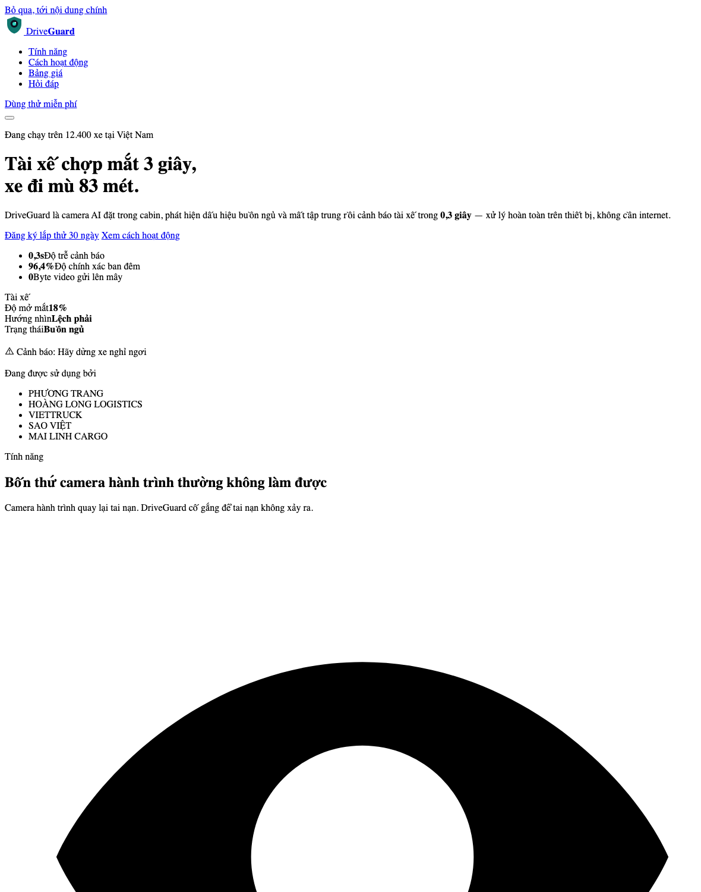
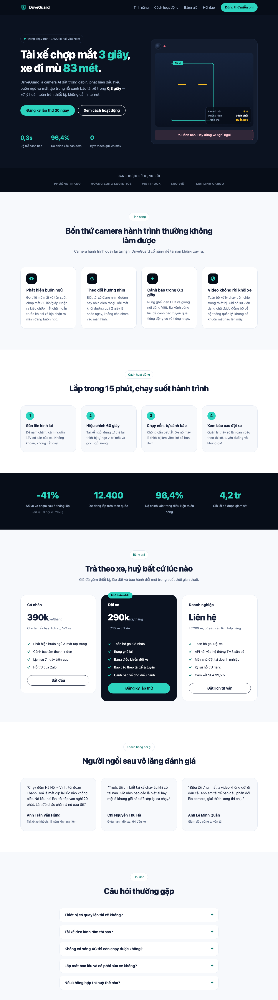
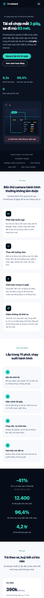
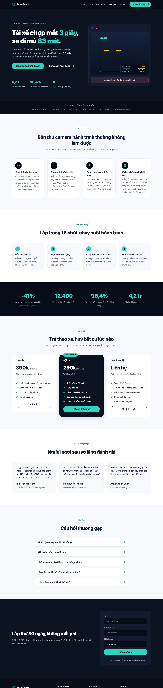
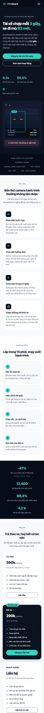
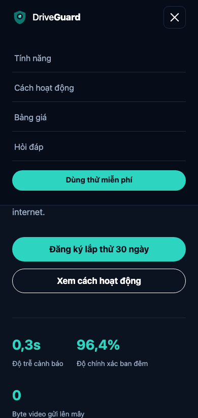

# Nhật ký Vibe Coding — Exercise 3 (Landing Page)

**Sản phẩm:** DriveGuard — camera AI trong cabin, cảnh báo tài xế buồn ngủ và mất tập trung
**Công cụ AI:** Claude Code (model **Claude Opus 5**)
**Ngày thực hiện:** 12/09/2026
**Số vòng lặp prompt:** 3 vòng (đúng 3 chủ đích đề bài yêu cầu)

| Vòng | Chủ đích theo đề bài | Sản phẩm của vòng |
|------|----------------------|-------------------|
| 1 | Khung cấu trúc — tạo HTML layout tổng thể | `index.html` |
| 2 | Styling & màu sắc — CSS theo một phong cách cụ thể | `style.css` |
| 3 | Chi tiết & polish — spacing, typography, hiệu ứng | `style.css` (bổ sung) + `script.js` |

---

## VÒNG 1 — Khung cấu trúc HTML

### Prompt ban đầu

> "Tạo khung HTML tổng thể cho một landing page một trang giới thiệu **DriveGuard** — camera AI đặt trong cabin xe, phát hiện tài xế buồn ngủ và mất tập trung rồi cảnh báo tức thì. Gồm các phần: header/nav, hero, thanh logo khách hàng, danh sách tính năng, cách hoạt động (các bước), dải số liệu, bảng giá 3 gói, đánh giá khách hàng, hỏi đáp, CTA cuối kèm form đăng ký, footer.
> Chưa cần style, chỉ cần cấu trúc HTML rõ ràng, dùng thẻ ngữ nghĩa (semantic), nội dung tiếng Việt và viết như người thật chứ đừng viết kiểu quảng cáo sáo rỗng."

### Kết quả nhận được

Một file `index.html` với đủ 10 phần. Điểm được:

- Dùng đúng thẻ ngữ nghĩa: `<header>` / `<main>` / `<section>` / `<nav>` / `<ol>` cho
  các bước / `<details>` cho hỏi đáp / `<footer>`.
- Phân cấp tiêu đề đúng: một `<h1>` duy nhất ở hero, `<h2>` cho từng phần, `<h3>` cho
  từng thẻ con.
- Có sẵn `aria-label` cho các vùng điều hướng, `aria-expanded`/`aria-controls` cho nút
  menu 3 gạch, link "bỏ qua tới nội dung chính" ở đầu trang.
- Phần hỏi đáp dùng `<details>/<summary>` nên **đóng/mở được ngay cả khi chưa có
  JavaScript**.
- Ảnh minh hoạ thiết bị được dựng bằng thẻ HTML thường (không dùng ảnh từ bên ngoài),
  để trang chạy được hoàn toàn ngoại tuyến.

### Kết quả giao diện



### Vấn đề phát sinh

1. **Trang hoàn toàn không có style** — đúng như yêu cầu của vòng này, nhưng chưa
   nhìn ra được sản phẩm là gì.
2. **Icon SVG nội tuyến phình to hết cỡ.** Khi chưa có CSS, `<svg>` không bị giới hạn
   kích thước nên mỗi icon chiếm gần trọn bề rộng trang (thấy rõ ở ảnh trên — hình
   con mắt khổng lồ). Cần đặt `width`/`height` cho `.icon` ở vòng sau.
3. **Làm hơi vượt phạm vi**: AI tự đặt sẵn cả hệ thống tên class theo quy ước BEM và
   thêm các thuộc tính accessibility, trong khi vòng này đề bài chỉ yêu cầu "cấu trúc
   thô". Điểm này được giữ lại vì có lợi cho vòng 2, nhưng cần ghi nhận là AI không
   bám sát đúng phạm vi được giao.

---

## VÒNG 2 — Styling & màu sắc

### Prompt tinh chỉnh

> "Thiết kế CSS cho khung HTML trên theo phong cách **'safety tech ban đêm'**: nền xanh mực rất tối (#0b1220) cho hero/footer xen kẽ với nền sáng cho các phần nội dung, màu điểm nhấn teal (#2dd4bf), màu hổ phách cho cảnh báo. Dùng font sans-serif hệ thống, bo góc lớn, layout dạng CSS Grid cho lưới tính năng / các bước / bảng giá. Khai báo màu thành biến CSS. Đảm bảo responsive cơ bản trên tablet và mobile."

### Kết quả nhận được

File `style.css` (~600 dòng):

- **Bảng màu** khai báo thành biến CSS trong `:root` (`--ink-900`, `--teal-400`, …) —
  đổi màu chủ đạo chỉ cần sửa một chỗ.
- **Nhịp sáng–tối xen kẽ**: hero tối → thanh logo tối → tính năng sáng → cách hoạt
  động trắng → dải số liệu tối → bảng giá sáng → … tạo nhịp thị giác cho trang dài.
- **Grid** cho `.cards` (4 cột), `.steps` (4 cột), `.plans` (3 cột), `.quotes` (3 cột).
- Ảnh minh hoạ thiết bị được "vẽ" hoàn toàn bằng CSS: khung nhận diện khuôn mặt,
  vạch quét, bảng chỉ số HUD, dòng cảnh báo màu hồng.
- **Hai mốc chuyển giao**: 960px (tablet → 2 cột) và 640px (mobile → 1 cột).
- `overflow-x: hidden` ở `body` để chặn tràn ngang.

### Kết quả giao diện

Desktop 1280px:



Mobile 390px:



### Vấn đề phát sinh

1. **Menu mobile không dùng được.** CSS đang để `.nav { display: none }` ở mobile và
   chỉ hiện nút 3 gạch. Nút này thuần trang trí — chưa có JavaScript nên bấm vào
   không có gì xảy ra. Hậu quả: **trên điện thoại không có cách nào điều hướng trong
   trang**, đây là lỗi nặng nhất của vòng 2.
2. **Bảng chỉ số HUD bị chật trên màn hình hẹp.** HUD đang đặt `position: absolute`
   với `width: 46%`; ở 390px thì 46% chỉ còn ~170px nên mỗi dòng "Hướng nhìn — Lệch
   phải" bị xuống dòng gãy khúc, rất khó đọc.
3. **Kích thước chữ và khoảng cách bị nhảy bậc.** Tiêu đề đang đặt cứng (`3.2rem`
   desktop → `2.1rem` mobile) và khoảng cách section cũng cứng (`96px` → `60px`).
   Ở các bề rộng trung gian (700–900px) bố cục chuyển đổi giật cục thay vì mượt.
4. **Trang hoàn toàn không có phản hồi khi tương tác.** Rê chuột vào thẻ tính năng,
   nút bấm hay bảng giá đều không thay đổi gì; cuộn trang thì mọi thứ hiện ra khô khốc.

---

## VÒNG 3 — Chi tiết & polish

### Prompt tinh chỉnh

> "Tinh chỉnh lại trang theo 4 nhóm:
> 1. **Spacing:** chuẩn hoá khoảng cách giữa các section về một biến dùng chung, cho co giãn liên tục theo bề rộng màn hình bằng `clamp()` thay vì nhảy bậc qua media query.
> 2. **Typography:** cỡ chữ tiêu đề dùng `clamp()`.
> 3. **Hiệu ứng:** nút bấm và thẻ nhô lên khi rê chuột, hiệu ứng hiện dần (fade-in) khi cuộn tới, vạch quét trong ảnh thiết bị chạy qua lại, đèn LED nhấp nháy.
> 4. **JavaScript:** làm nút menu 3 gạch hoạt động được trên mobile, đánh dấu mục đang xem trên thanh nav, kiểm tra biểu mẫu đăng ký (tên + số điện thoại Việt Nam) ngay trên trang.
>
> Đồng thời sửa lỗi bảng HUD bị chật ở màn hình hẹp, và tôn trọng thiết lập `prefers-reduced-motion`."

### Kết quả nhận được

**`style.css` (bổ sung ~150 dòng):**

- Thang khoảng cách dùng chung:
  ```css
  --space-section: clamp(56px, 8vw, 96px);
  --space-gap:     clamp(16px, 2vw, 24px);
  ```
  Mọi `padding` của section và `gap` của lưới đều trỏ về hai biến này → khoảng cách
  co giãn liên tục, không còn bậc thang.
- Tiêu đề dùng `clamp()`, ví dụ hero: `clamp(2.05rem, 1.15rem + 3.9vw, 3.3rem)`.
- `.reveal` → `.reveal.is-visible`: mờ + dịch lên 18px, có `--reveal-delay` để các thẻ
  trong cùng một hàng hiện nối tiếp nhau chứ không hiện cùng lúc.
- Hover: thẻ nhô lên 4px kèm đổ bóng, icon xoay nhẹ 4°, nút chính nhô lên kèm quầng
  sáng teal, gạch chân chạy ra ở menu.
- Hoạt hình trong ảnh thiết bị: `scanline` (vạch quét 4,2s), `blink` (mắt chớp),
  `pulse-led` (đèn LED thở).
- Menu mobile chuyển từ `display: none` thành **bảng trượt xuống** dưới header, có
  hoạt ảnh, khoá cuộn nền khi mở, nút 3 gạch biến thành dấu **X**.
- Khối `@media (prefers-reduced-motion: reduce)` tắt toàn bộ hoạt hình.

**`script.js` (file mới, ~120 dòng)** — 4 việc CSS không làm được:

1. Đóng/mở menu mobile (bấm nút, bấm vào một mục, bấm phím Esc, và tự đóng khi quay
   lại desktop).
2. `IntersectionObserver` kích hoạt hiệu ứng hiện dần đúng lúc phần tử lọt vào khung
   nhìn; mỗi phần tử chỉ chạy một lần (`unobserve`) nên cuộn nhanh không bị giật.
3. Theo dõi mục đang xem để tô sáng đúng mục trên thanh điều hướng.
4. Kiểm tra biểu mẫu: tên tối thiểu 2 ký tự, số điện thoại khớp `^(0|\+?84)\d{9}$`.

### Kết quả giao diện

Desktop 1280px — chú ý mục "Cách hoạt động" trên thanh nav đang được tô sáng tự động
theo vị trí cuộn:



Mobile 390px — bảng HUD đã trải hết bề ngang, nút hero chiếm trọn chiều rộng:



Menu mobile sau khi bấm nút 3 gạch (nút đã đổi thành dấu X):



### Kiểm thử thực tế

Mở trang bằng trình duyệt thật ở 390×780 và chạy thử:

| Kịch bản | Kết quả |
|----------|---------|
| Bấm nút 3 gạch | Menu trượt xuống, nút đổi thành X, `aria-expanded="true"` |
| Gửi form với SĐT `123` | "Số điện thoại chưa đúng định dạng (ví dụ: 0912345678)." |
| Gửi form với tên `A` | "Bạn nhập giúp họ tên nhé." |
| Gửi form với `+84 912 345 678` | Nhận, hiện lời xác nhận màu teal |
| Console trình duyệt | Không có lỗi |

### Vấn đề phát sinh

1. **Lần bấm nút 3 gạch đầu tiên không ăn.** Khi kiểm thử, cú click đầu không kích
   hoạt được menu. Kiểm tra lại bằng `document.getElementById('navToggle').click()`
   thì hàm xử lý chạy đúng → kết luận là cú click đầu bị trượt toạ độ chứ không phải
   lỗi code. Ghi lại để tránh kết luận sai.
2. **Một chỗ viết mong manh trong `script.js`.** Đoạn kiểm tra form đang lấy ô nhập
   bằng `form.name` / `form.phone`. Cách này hiện chạy đúng vì thẻ `<form>` không có
   thuộc tính `name`, nhưng `name` vốn là thuộc tính có sẵn của `HTMLFormElement` —
   chỉ cần sau này ai đó thêm `name="..."` vào thẻ `<form>` là `form.name` sẽ trả về
   một chuỗi chứ không còn trả về ô nhập nữa, và trang sẽ lỗi.

### Thay đổi thủ công

| Thay đổi | Lý do |
|----------|-------|
| Đổi `form.name` / `form.phone` → `form.elements.namedItem('name')` / `('phone')` | Sửa chỗ mong manh nói trên. `form.elements` là cách tra cứu ô nhập chính thống, không phụ thuộc vào việc thẻ `<form>` có thuộc tính `name` hay không |
| Xoá `.nav { display: none }` trong khối `@media (max-width: 640px)` của Vòng 2 | Sau Vòng 3, menu mobile được xử lý ở khối `@media (max-width: 860px)`. Hai khối cùng nhắm `.nav` gây chồng chéo, người đọc code sau này dễ nhầm. Xoá luật cũ và ghi chú lại chỗ xử lý mới |
| Sửa `#3b4d６e` → `#3b4d6e` trong `radial-gradient` của `.device__lens` | Ký tự `６` là số 6 full-width (lỗi gõ). Trình duyệt coi cả giá trị màu là không hợp lệ và bỏ qua, nên ống kính camera bị mất hiệu ứng chuyển màu |
| Đổi mốc chuyển giao của menu mobile từ 640px lên **860px** | Ở 700–850px, thanh nav ngang đã chật (5 mục + nút CTA) nhưng vẫn chưa chuyển sang menu thu gọn. Nâng mốc lên 860px để phần chuyển đổi xảy ra đúng lúc |
| Tự viết nội dung (số liệu, câu trích dẫn khách hàng, câu hỏi thường gặp) | Nội dung AI sinh lần đầu nghe sáo rỗng kiểu quảng cáo. Đã viết lại theo hướng cụ thể và có con số ("chợp mắt 3 giây, xe đi mù 83 mét"), vì landing page sống bằng nội dung chứ không bằng CSS |

---

## Tổng kết kỹ thuật

| Hạng mục | Chi tiết |
|----------|----------|
| Số file | 3 (`index.html`, `style.css`, `script.js`) + 1 logo SVG |
| Phụ thuộc bên ngoài | **Không có** — không CDN, không Google Fonts, không ảnh từ internet. Trang chạy được hoàn toàn ngoại tuyến |
| Mốc chuyển giao | 960px (tablet), 860px (menu mobile), 640px (1 cột), 520px (HUD toàn chiều ngang) |
| Khả năng tiếp cận | Link bỏ qua, phân cấp tiêu đề đúng, `aria-*` cho menu, viền focus rõ, vùng chạm ≥ 44px, tôn trọng `prefers-reduced-motion` |
| Hoạt động khi tắt JavaScript | Trang vẫn đọc được đầy đủ; hỏi đáp vẫn đóng/mở được nhờ `<details>`; chỉ mất menu mobile và hiệu ứng |

## Bài học rút ra

1. **Chia 3 vòng theo chủ đích là cách làm việc với AI hiệu quả.** Gộp tất cả vào một
   prompt thì AI sẽ "trung bình hoá" mọi thứ và mình không kiểm soát được vòng nào
   hỏng. Tách ra thì mỗi vòng có một thứ để kiểm tra.
2. **AI hay làm vượt phạm vi được giao.** Vòng 1 chỉ cần khung thô nhưng AI tự thêm
   cả hệ thống class và accessibility. Lần này có lợi, nhưng nếu không đọc kỹ thì
   sẽ không biết trong code có những gì.
3. **Phải mở trình duyệt bấm thử, không tin vào việc đọc code.** Lỗi menu mobile
   (nút 3 gạch chỉ có vỏ, không có JS) là loại lỗi mà đọc CSS sẽ không thấy.
4. **AI không tự phát hiện lỗi gõ ký tự.** Ký tự `６` full-width nằm im trong một giá
   trị màu suốt cả vòng 2; trình duyệt âm thầm bỏ qua chứ không báo lỗi.
5. **Nội dung mới là phần khó nhất của landing page**, và cũng là phần AI làm yếu
   nhất nếu chỉ đưa yêu cầu chung chung.
