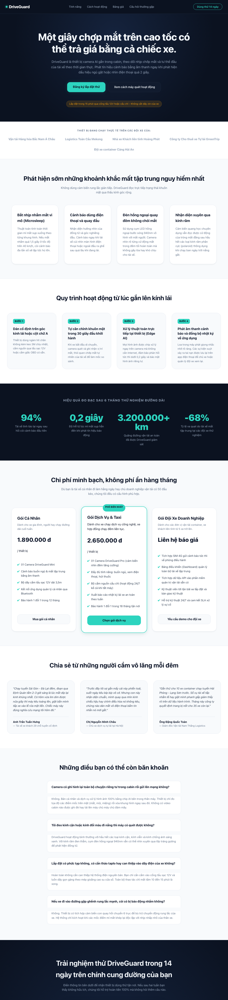
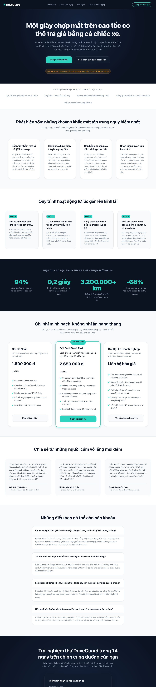

# Nhật ký Vibe Coding — Exercise 3 (Landing Page) — Công cụ 2

**Sản phẩm:** DriveGuard — camera AI trong cabin, cảnh báo tài xế buồn ngủ và mất tập trung
**Công cụ AI:** **Gemini 3.8 Flash** (gemini.google.com)
**Ngày thực hiện:** 12/09/2026
**Prompt sử dụng:** chép nguyên văn từ [`../PROMPTS.md`](../PROMPTS.md) — cùng bộ với Claude

| Vòng | Chủ đích | Trạng thái |
|------|----------|------------|
| 1 | Khung cấu trúc HTML | Xong |
| 2 | Styling & màu sắc | Xong |
| 3 | Chi tiết & polish | Xong |

Link hội thoại gốc: https://share.gemini.google/rmqF7ZMARH6H

---

## VÒNG 1 — Khung cấu trúc HTML

### Prompt ban đầu

Giống hệt prompt đã gửi Claude (xem [`../PROMPTS.md`](../PROMPTS.md) — Vòng 1).

### Kết quả nhận được

Một file `index.html` duy nhất, đủ 10 phần theo yêu cầu. Điểm đáng chú ý:

- **Bám sát phạm vi prompt rất chặt.** Đề bài vòng này nói "chưa cần style, chỉ cần
  cấu trúc HTML" — Gemini trả về HTML **thuần, không một thuộc tính `class` nào**.
  Đây là điểm khác biệt lớn nhất so với Claude (Claude tự đặt sẵn cả hệ thống class
  theo quy ước BEM).
- **Chọn thẻ ngữ nghĩa đa dạng hơn:**
  - `<dl>/<dt>/<dd>` cho phần hỏi đáp
  - `<figure>/<blockquote>/<figcaption>` cho đánh giá khách hàng
  - `<ol>` lồng `<article>` có `<header>` riêng cho từng bước
  - `<address>` trong footer cho thông tin liên hệ
  - `<aside>` cho dòng ghi chú phụ trong hero
- **Biểu mẫu đầy đủ hơn Claude:** có `<fieldset>` + `<legend>`, thêm ô `<textarea>`
  ghi chú, và `placeholder` cụ thể cho từng ô.
- **Nội dung tiếng Việt rất tự nhiên.** Các câu trích dẫn khách hàng viết đúng giọng
  tài xế đường dài ("mắt díp lại kinh khủng nhất", "giật bắn mình tấp xe vào lề rửa
  mặt liền"), địa danh cụ thể (Định Quán, Hải Phòng – Lạng Sơn). Chi tiết kỹ thuật
  cũng cụ thể: LED hồng ngoại 940nm, cảm biến con quay hồi chuyển 6 trục.

### Kết quả giao diện

Vì không có icon SVG nội tuyến nên trang thô của Gemini **dễ đọc hơn** trang thô của
Claude (bên Claude bị icon SVG phình to chiếm gần hết bề rộng).

### Vấn đề phát sinh

| Vấn đề | Diễn giải |
|--------|-----------|
| **Không có nút menu 3 gạch** | Header chỉ có `<nav>` với danh sách link. Không có `<button>` nào cho menu mobile, cũng không có `aria-expanded`/`aria-controls`. Tới vòng 2–3 sẽ phải bổ sung thẻ mới vào HTML chứ không chỉ viết CSS/JS |
| **Thiếu link "bỏ qua tới nội dung chính"** | Claude tự thêm skip-link ngay vòng 1; Gemini không có |
| **Dùng `<blockquote>` để bọc con số thống kê** | `<blockquote>94%</blockquote>` — sai ngữ nghĩa. `<blockquote>` dành cho đoạn trích dẫn, không phải cho số liệu. Đúng ra nên dùng `
` hoặc `<strong>` trong `<figure>` |
| **Hỏi đáp dùng `<dl>` nên không tự đóng/mở được** | Claude dùng `
/
` — đóng mở được ngay cả khi tắt JavaScript. Bản Gemini sẽ phải viết thêm JavaScript ở vòng 3 để làm accordion |
| **Toàn bộ `
` không có tên** | Bám prompt thì đúng, nhưng sang vòng 2 sẽ không có "móc" để viết CSS. Hoặc Gemini phải sửa lại HTML, hoặc phải viết CSS dựa vào bộ chọn theo cấu trúc (dễ vỡ) |
| **Lỗi lặp từ trong nội dung** | Phần hỏi đáp có câu "...tải lên máy chủ **máy chủ** đám mây" — lặp chữ "máy chủ" |
| **Số liệu không khớp với bản Claude** | Gemini tự chọn 0,2 giây / 94% / -68% / 3.200.000 km; Claude chọn 0,3 giây / 96,4% / -41% / 12.400 xe. Không phải lỗi (prompt không cho số cụ thể), nhưng cần lưu ý khi so sánh: hai bản là hai sản phẩm khác nhau về nội dung |

### Thay đổi thủ công

Chưa sửa gì — giữ nguyên đúng những gì Gemini trả về để phần so sánh ở vòng sau
được công bằng.

---

## VÒNG 2 — Styling & màu sắc

### Prompt tinh chỉnh

Giống hệt prompt đã gửi Claude (xem [`../PROMPTS.md`](../PROMPTS.md) — Vòng 2).

### Kết quả nhận được

Một khối CSS ~700 dòng, chia 13 mục có đánh số và tiêu đề rõ ràng.

- **Bảng màu bám đúng yêu cầu** và khai báo đầy đủ thành biến CSS: `--bg-night`,
  `--accent-teal`, `--warning-amber`, kèm cả biến "glow" bán trong suốt
  (`--accent-teal-glow`) để dùng cho đổ bóng phát sáng.
- **Nhịp sáng–tối xen kẽ** đúng như prompt: header/hero tối → thanh logo sáng →
  tính năng sáng → cách hoạt động trắng → số liệu tối → bảng giá sáng → đánh giá
  trắng → hỏi đáp sáng → form CTA tối → footer tối nhất (`#060a12`).
- **Lưới dùng `repeat(auto-fit, minmax(260px, 1fr))`** cho cả 4 khu vực. Cách này
  tự đổi số cột theo bề rộng mà **không cần media query** — linh hoạt hơn cách
  Claude làm (cố định 4 cột rồi ghi đè qua 2 media query).
- **Hai điểm nhấn thị giác tự nghĩ thêm**: `radial-gradient` toả từ giữa cho hero
  và form CTA (mô phỏng ánh đèn táp-lô trong khoang lái ban đêm), và chấm tròn
  teal phát sáng đặt trước chữ "DriveGuard" bằng `::before`.
- Thẻ gói giữa được làm nổi bằng `transform: scale(1.02)` + viền teal + quầng sáng.

### Kết quả giao diện

Desktop 1280px:

Mobile 390px:

### Vấn đề phát sinh

| Vấn đề | Diễn giải |
|--------|-----------|
| **Thanh header chiếm 25% màn hình điện thoại** | Đo thực tế ở 390×780: header cao **194px**. Vì vòng 1 không có nút menu 3 gạch nên vòng 2 chỉ còn cách xếp dọc (`flex-direction: column`) — logo một hàng, 4 link nav xuống hàng, nút CTA một hàng. Header lại đang `position: sticky` nên khối này **dính theo suốt lúc cuộn**, che mất 1/4 màn hình |
| **Vùng chạm của link nav chỉ cao 18px** | Đo thực tế. Chuẩn tối thiểu của Apple/Google là 44px. Trên điện thoại rất dễ bấm trượt sang link bên cạnh |
| **CSS phụ thuộc vào cấu trúc DOM, rất dễ vỡ** | Hệ quả trực tiếp của việc vòng 1 không có class nào. Gemini phải viết những bộ chọn như `#bang-gia article:nth-child(2)`, `body > header > a:first-child`, `#hero a[href="#dang-ky"]`, `#bang-gia header p:nth-of-type(1)`. Chỉ cần chèn thêm một thẻ hoặc đổi thứ tự gói giá là style hỏng. Bản Claude dùng class nên không gặp vấn đề này |
| **Làm vượt phạm vi vòng 2** | Prompt vòng 2 chỉ yêu cầu styling và màu sắc, nhưng Gemini đã tự thêm `clamp()` cho tiêu đề, hiệu ứng hover nhô thẻ, và `transition` — đây vốn là nội dung của vòng 3. Lặp lại đúng xu hướng đã thấy ở vòng 1 |
| **Hỏi đáp vẫn là danh sách phẳng** | `<dl>` được tạo kiểu cho đẹp nhưng cả 4 câu trả lời đều mở sẵn, không gập lại được. Phần hỏi đáp vì vậy dài lê thê. Bản Claude dùng `
` nên gập sẵn từ vòng 1 |
| **Không có `prefers-reduced-motion`** | Có `transition: all 0.2s ease` áp cho mọi thẻ `<a>` nhưng không có khối tôn trọng thiết lập giảm chuyển động của hệ điều hành |

### Thay đổi thủ công

| Thay đổi | Lý do |
|----------|-------|
| Tách CSS ra file `style.css` riêng và thêm thẻ `<link>` vào `index.html` | Gemini hướng dẫn dán CSS vào thẻ `<style>` trong `<head>`. Tách ra file riêng để cấu trúc thư mục giống hệt bản Claude, đối chiếu cho công bằng. Nội dung CSS giữ nguyên 100%, không sửa một dòng nào |

---

---

## VÒNG 3 — Chi tiết & polish

### Prompt tinh chỉnh

Giống hệt prompt đã gửi Claude (xem [`../PROMPTS.md`](../PROMPTS.md) — Vòng 3).

### Kết quả nhận được

Gemini mở đầu bằng câu *"Dưới đây là mã hoàn chỉnh đã tích hợp cả HTML, CSS tinh
chỉnh và JavaScript vào một file duy nhất"*, bắt đầu in ra file HTML gộp — nhưng
**đoạn mã bị đứt giữa chừng** ở khối `:root` rồi chuyển sang một câu trả lời khác
theo bố cục 4 mục. Phần giao nộp thực tế gồm:

1. Khối biến `clamp()` cho spacing và typography
2. Khối CSS hiệu ứng (hover, fade-in, LED, vạch quét, HUD, `prefers-reduced-motion`)
3. File JavaScript xử lý menu, scrollspy, fade-in, kiểm tra biểu mẫu
4. Một **"Khung HTML mẫu tích hợp"** — trang demo chung chung với các mục
   `#overview`, `#specs`, `#register` và nội dung *"Tốc độ: 120 km/h",
   "Áp suất: 2.4 bar", "Nhiệt độ: 42°C"* — **không liên quan gì tới landing page
   DriveGuard** mà chính nó đã viết ở vòng 1 và 2.

Xét riêng chất lượng từng đoạn thì tốt: `clamp()` có công thức hợp lý, regex số
điện thoại Việt Nam (`^(03|05|07|08|09)\d{8}$`) chặt hơn của Claude, có
`aria-current` cho scrollspy, có lọc ký tự không phải số khi người dùng gõ, và có
khối `prefers-reduced-motion` đầy đủ.

### Vấn đề phát sinh — đo bằng số liệu

Đã dán nguyên văn CSS và JS của vòng 3 vào trang vòng 2 (đúng như một người dùng
bình thường sẽ làm) rồi mở trình duyệt đo thực tế:

**a) Không một bộ chọn nào khớp: 0/14**

| Bộ chọn Gemini dùng ở vòng 3 | Số phần tử khớp trong `index.html` của chính nó |
|---|---|
| `.card` | 0 |
| `.btn` | 0 |
| `.reveal-on-scroll` | 0 |
| `.led-indicator` | 0 |
| `.device-screen` | 0 |
| `.hud-panel` | 0 |
| `.menu-toggle` | 0 |
| `.nav-menu` | 0 |
| `.nav-link` | 0 |
| `#register-form` | 0 |
| `#full-name` | 0 |
| `#phone-number` | 0 |
| `#name-error` | 0 |
| `#phone-error` | 0 |

Nguyên nhân gốc: **vòng 1 Gemini trả về HTML không có một class nào**, còn vòng 3
lại viết CSS/JS dựa hoàn toàn vào class. Ô nhập trong biểu mẫu vòng 1 tên là
`#ho-ten` và `#so-dien-thoai`, thẻ `<form>` không có `id`; vòng 3 lại đi tìm
`#register-form`, `#full-name`, `#phone-number`.

Hệ quả: **toàn bộ nhóm 3 và nhóm 4 của prompt đều không chạy.** Không có hover
nhô thẻ, không fade-in, không menu mobile, không scrollspy, không kiểm tra biểu
mẫu. JavaScript cũng không báo lỗi ra console — nó thoát êm ở dòng
`if (!form) return;` nên nhìn bề ngoài tưởng như mọi thứ bình thường.

**b) Nhóm 1 và 2 cũng gần như vô hiệu vì thua độ ưu tiên bộ chọn**

Vòng 3 viết `section { padding-block: var(--section-spacing) }` và
`h1 { font-size: var(--text-h1) }` — bộ chọn theo thẻ. Nhưng vòng 2 đã viết
`#tinh-nang { padding: 5rem 1.5rem }` và `#hero h1 { font-size: ... }` — bộ chọn
theo `id`, độ ưu tiên cao hơn hẳn. Đo ở 390×780:

| Thuộc tính | Giá trị vòng 3 muốn đặt | Giá trị thực tế đo được | Kết luận |
|---|---|---|---|
| `#tinh-nang` padding dọc | `clamp(3rem, 2rem+5vw, 7rem)` ≈ 68px | **80px** (= 5rem của vòng 2) | Không ăn |
| `#hero h1` cỡ chữ | `clamp(2.25rem, …, 4.5rem)` | **32px** (= 2rem của vòng 2) | Không ăn |
| `#tinh-nang h2` cỡ chữ | `clamp(1.75rem, …, 3rem)` | **35.2px** (= 2.2rem của vòng 2) | Không ăn |

**c) Lỗi phân cấp tiêu đề bị đảo ngược trên mobile**

Hệ quả trực tiếp của mục (b): ở 390px, **`h1` cao 32px trong khi `h2` cao 35,2px**
— tiêu đề chính của trang nhỏ hơn tiêu đề của một mục con. Lỗi này sinh ra từ vòng 2
(`#tinh-nang h2` đặt cứng `2.2rem`, không có mốc thu nhỏ cho mobile) và vòng 3 đã
**không sửa được** vì bộ chọn `h2` chung chung thua `#tinh-nang h2`.

**d) Sửa lỗi cho thứ không tồn tại**

Prompt yêu cầu "sửa lỗi bảng HUD bị chật ở màn hình hẹp" — đây là lỗi của **bản
Claude**, vì chỉ bản Claude mới có ảnh minh hoạ thiết bị kèm bảng HUD. Trang của
Gemini chưa từng có phần tử nào như vậy. Thay vì nói rõ "trang của bạn không có
HUD", Gemini vẫn viết ra `.hud-panel`, `.device-screen`, `.led-indicator` và tự
dựng một trang demo có "Tốc độ / Áp suất / Nhiệt độ" để minh hoạ.

### Kết quả giao diện

Desktop 1280px:

Mobile 390px:

So với vòng 2, giao diện **gần như không đổi** — đúng như đo đạc ở trên.

### Thay đổi thủ công

| Thay đổi | Lý do |
|----------|-------|
| Nối CSS vòng 3 vào cuối `style.css`, tạo `script.js`, thêm thẻ `<script>` vào `index.html` | Để chạy thử được đúng kịch bản một người dùng bình thường sẽ làm: dán code AI trả về vào dự án đang có. **Không sửa một dòng nào** trong code của Gemini — mọi thứ giữ nguyên văn để kết quả đo phản ánh đúng chất lượng đầu ra |

> Có thể chữa cho bản Gemini chạy được bằng cách thêm class vào HTML cho khớp với
> CSS/JS vòng 3. Nhưng làm vậy là **mình viết bài chứ không phải AI**, và sẽ làm
> hỏng phép so sánh với bản Claude. Vì vậy giữ nguyên hiện trạng và ghi lại đúng
> những gì đo được.
