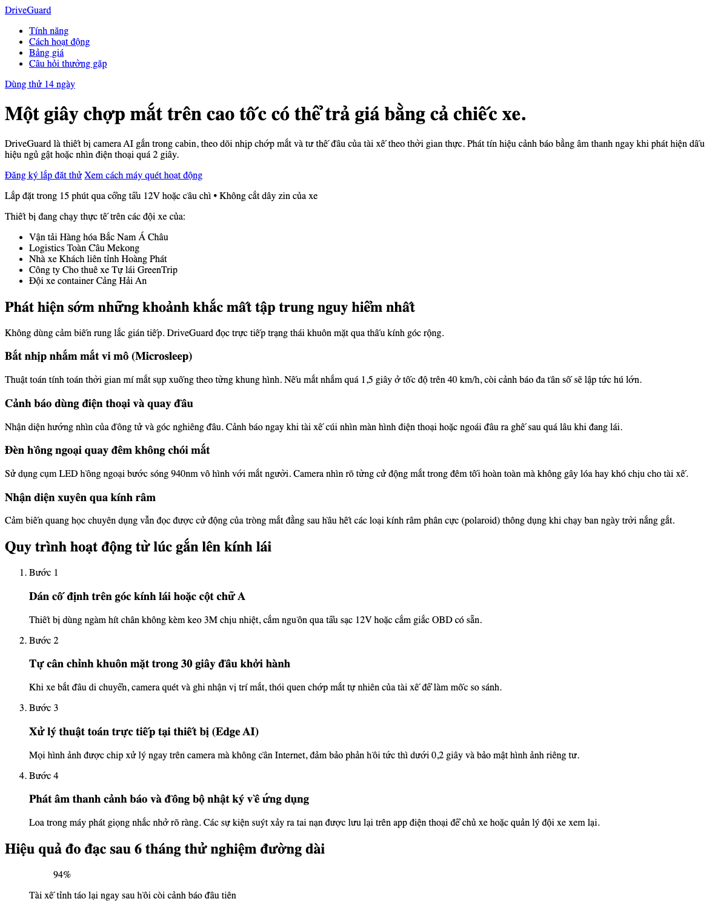

# Nhật ký Vibe Coding — Exercise 3 (Landing Page) — Công cụ 2

**Sản phẩm:** DriveGuard — camera AI trong cabin, cảnh báo tài xế buồn ngủ và mất tập trung
**Công cụ AI:** **Gemini 3.8 Flash** (gemini.google.com)
**Ngày thực hiện:** 12/09/2026
**Prompt sử dụng:** chép nguyên văn từ [`../PROMPTS.md`](../PROMPTS.md) — cùng bộ với Claude

| Vòng | Chủ đích | Trạng thái |
|------|----------|------------|
| 1 | Khung cấu trúc HTML | Xong |
| 2 | Styling & màu sắc | Chưa chạy |
| 3 | Chi tiết & polish | Chưa chạy |

Link hội thoại gốc: https://share.gemini.google/pbCE91P7SEJf

---

## VÒNG 1 — Khung cấu trúc HTML

### Prompt ban đầu

Giống hệt prompt đã gửi Claude (xem [`../PROMPTS.md`](../PROMPTS.md) — Vòng 1).

### Kết quả nhận được

Một file `index.html` duy nhất, đủ 10 phần theo yêu cầu. Điểm đáng chú ý:

- **Bám sát phạm vi prompt rất chặt.** Đề bài vòng này nói "chưa cần style, chỉ cần
  cấu trúc HTML" — Gemini trả về HTML **thuần, không một thuộc tính `class` nào**.
  Đây là điểm khác biệt lớn nhất so với Claude (Claude tự đặt sẵn cả hệ thống class
  theo quy ước BEM).
- **Chọn thẻ ngữ nghĩa đa dạng hơn:**
  - `<dl>/<dt>/<dd>` cho phần hỏi đáp
  - `<figure>/<blockquote>/<figcaption>` cho đánh giá khách hàng
  - `<ol>` lồng `<article>` có `<header>` riêng cho từng bước
  - `<address>` trong footer cho thông tin liên hệ
  - `<aside>` cho dòng ghi chú phụ trong hero
- **Biểu mẫu đầy đủ hơn Claude:** có `<fieldset>` + `<legend>`, thêm ô `<textarea>`
  ghi chú, và `placeholder` cụ thể cho từng ô.
- **Nội dung tiếng Việt rất tự nhiên.** Các câu trích dẫn khách hàng viết đúng giọng
  tài xế đường dài ("mắt díp lại kinh khủng nhất", "giật bắn mình tấp xe vào lề rửa
  mặt liền"), địa danh cụ thể (Định Quán, Hải Phòng – Lạng Sơn). Chi tiết kỹ thuật
  cũng cụ thể: LED hồng ngoại 940nm, cảm biến con quay hồi chuyển 6 trục.

### Kết quả giao diện

Vì không có icon SVG nội tuyến nên trang thô của Gemini **dễ đọc hơn** trang thô của
Claude (bên Claude bị icon SVG phình to chiếm gần hết bề rộng).

### Vấn đề phát sinh

| Vấn đề | Diễn giải |
|--------|-----------|
| **Không có nút menu 3 gạch** | Header chỉ có `<nav>` với danh sách link. Không có `<button>` nào cho menu mobile, cũng không có `aria-expanded`/`aria-controls`. Tới vòng 2–3 sẽ phải bổ sung thẻ mới vào HTML chứ không chỉ viết CSS/JS |
| **Thiếu link "bỏ qua tới nội dung chính"** | Claude tự thêm skip-link ngay vòng 1; Gemini không có |
| **Dùng `<blockquote>` để bọc con số thống kê** | `<blockquote>94%</blockquote>` — sai ngữ nghĩa. `<blockquote>` dành cho đoạn trích dẫn, không phải cho số liệu. Đúng ra nên dùng `
` hoặc `<strong>` trong `<figure>` |
| **Hỏi đáp dùng `<dl>` nên không tự đóng/mở được** | Claude dùng `
/
` — đóng mở được ngay cả khi tắt JavaScript. Bản Gemini sẽ phải viết thêm JavaScript ở vòng 3 để làm accordion |
| **Toàn bộ `
` không có tên** | Bám prompt thì đúng, nhưng sang vòng 2 sẽ không có "móc" để viết CSS. Hoặc Gemini phải sửa lại HTML, hoặc phải viết CSS dựa vào bộ chọn theo cấu trúc (dễ vỡ) |
| **Lỗi lặp từ trong nội dung** | Phần hỏi đáp có câu "...tải lên máy chủ **máy chủ** đám mây" — lặp chữ "máy chủ" |
| **Số liệu không khớp với bản Claude** | Gemini tự chọn 0,2 giây / 94% / -68% / 3.200.000 km; Claude chọn 0,3 giây / 96,4% / -41% / 12.400 xe. Không phải lỗi (prompt không cho số cụ thể), nhưng cần lưu ý khi so sánh: hai bản là hai sản phẩm khác nhau về nội dung |

### Thay đổi thủ công

Chưa sửa gì — giữ nguyên đúng những gì Gemini trả về để phần so sánh ở vòng sau
được công bằng.

---

## VÒNG 2 — Styling & màu sắc

_(Chưa chạy)_

---

## VÒNG 3 — Chi tiết & polish

_(Chưa chạy)_
